

# Aleutian Island 2022 Bottom Trawl Survey

## [Core Otolith Requests](#top)

The goal is to assess the feasibility of the core otolith request using
haul data from the past five survey years. Requests for each species
include collection rules and a total otolith pair requested. The main
questions that drive the feasibility of the requeted core otolith
requests are:

1)  Given the requested collection rules, how well could the survey
    achieve the requested target across species?
2)  What is the total amount of otolith pairs collected over the survey?
3)  How many otolith pairs are collected during each haul?
4)  Given 30 otolith pairs are a maximum haul-total, how often are hauls
    over this threshold?

For the last five survey years, hauls were sampled with replacement
until a bootstrapped sample of 420 hauls were obtained. The collection
rule was applied to each haul and the total number of otoliths collected
was totaled. This was repeated 1000 times to obtain a distribution of
total otoliths collected conditional on the collection rule requested
this year.

Below are the species (and associated stock assessment authors)
requested for otolith collections. Click on the

|                   Common Name                   | Stock Assessment Author |
| :---------------------------------------------: | :---------------------: |
|    [northern rock sole](#northern-rock-sole)    |    Carey McGilliard     |
|    [southern rock sole](#southern-rock-sole)    |    Carey McGilliard     |
|           [Pacific cod](#Pacific-cod)           |      Ingrid Spies       |
|        [dusky rockfish](#dusky-rockfish)        |      Jane Sullivan      |
|    [harlequin rockfish](#harlequin-rockfish)    |      Jane Sullivan      |
| [shortspine thornyhead](#shortspine-thornyhead) |      Jane Sullivan      |
|   [arrowtooth flounder](#arrowtooth-flounder)   |     Kalei Shotwell      |
|   [shortraker rockfish](#shortraker-rockfish)   |     Kalei Shotwell      |
|      [Greenland turbot](#Greenland-turbot)      |      Meaghan Bryan      |
|    [Kamchatka flounder](#Kamchatka-flounder)    |      Meaghan Bryan      |
| [blackspotted rockfish](#blackspotted-rockfish) |      Paul Spencer       |
|     [northern rockfish](#northern-rockfish)     |      Paul Spencer       |
|   [Pacific ocean perch](#Pacific-ocean-perch)   |      Paul Spencer       |
|     [rougheye rockfish](#rougheye-rockfish)     |      Paul Spencer       |
|         [Atka mackerel](#Atka-mackerel)         |       Sandra Lowe       |
|       [walleye pollock](#walleye-pollock)       |     Steve Barbeaux      |

## Summary

Under the requested collection rules, between 7383 and 8136.5 total
otolith pairs (median values) were collected from bootstrapped surveys
over the past five survey years. Haul-level otolith totals ranged from
17 and 19 otolith pairs, with 5-12% of hauls over collecting over 30
otolith pairs.

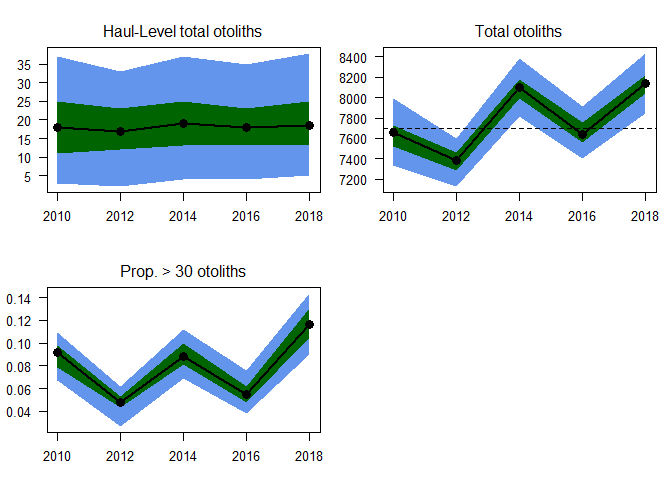<!-- -->

## arrowtooth flounder

[top](#top)

|      **Management Area**       | **Quantity** |
| :----------------------------: | :----------: |
|   Southern Bering Sea (SBS)    |      3       |
| Eastern Aleutian Islands (EAI) |      3       |
| Central Aleutian Islands (CAI) |      3       |
| Western Aleutian Islands (WAI) |      3       |

  - If \< 10 are collected, do not collect.

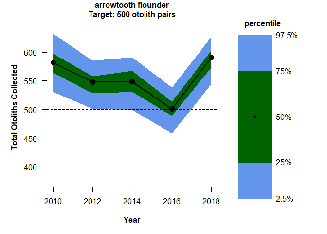<!-- -->

## Atka mackerel

[top](#top)

|      **Management Area**       | **Quantity** |
| :----------------------------: | :----------: |
|   Southern Bering Sea (SBS)    |      10      |
| Eastern Aleutian Islands (EAI) |      10      |
| Central Aleutian Islands (CAI) |      10      |
| Western Aleutian Islands (WAI) |      10      |

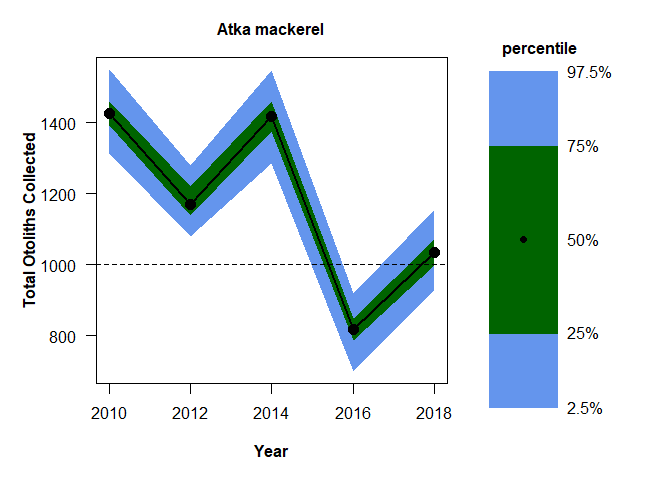<!-- -->

## blackspotted rockfish

[top](#top)

|      **Management Area**       | **Quantity** |
| :----------------------------: | :----------: |
|   Southern Bering Sea (SBS)    |      8       |
| Eastern Aleutian Islands (EAI) |      8       |
| Central Aleutian Islands (CAI) |      8       |
| Western Aleutian Islands (WAI) |      8       |

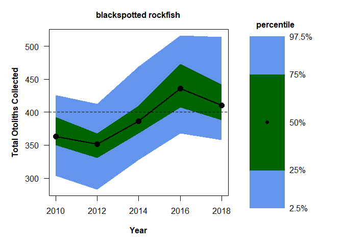<!-- -->

## dusky rockfish

[top](#top)

|      **Management Area**       | **Quantity** |
| :----------------------------: | :----------: |
|   Southern Bering Sea (SBS)    |      8       |
| Eastern Aleutian Islands (EAI) |      8       |
| Central Aleutian Islands (CAI) |      8       |
| Western Aleutian Islands (WAI) |      8       |

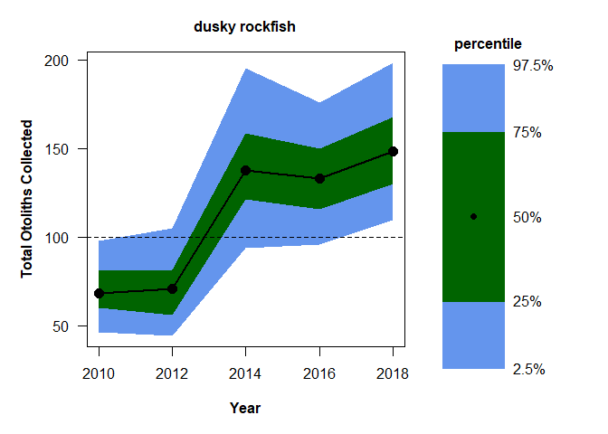<!-- -->

## Greenland turbot

[top](#top)

|      **Management Area**       | **Quantity** |
| :----------------------------: | :----------: |
|   Southern Bering Sea (SBS)    |      15      |
| Eastern Aleutian Islands (EAI) |      15      |
| Central Aleutian Islands (CAI) |      15      |
| Western Aleutian Islands (WAI) |      15      |

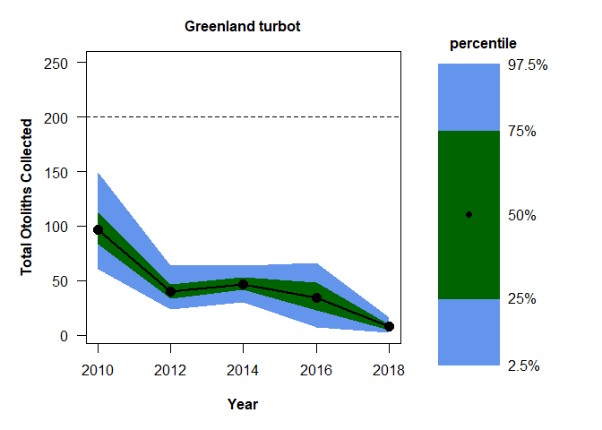<!-- -->

## harlequin rockfish

[top](#top)

|      **Management Area**       | **Quantity** |
| :----------------------------: | :----------: |
|   Southern Bering Sea (SBS)    |      3       |
| Eastern Aleutian Islands (EAI) |      3       |
| Central Aleutian Islands (CAI) |      3       |
| Western Aleutian Islands (WAI) |      3       |

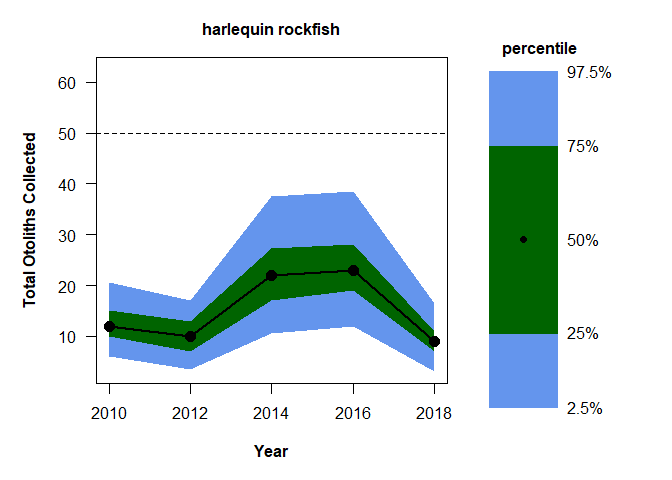<!-- -->

## Kamchatka flounder

[top](#top)

|      **Management Area**       | **Quantity** |
| :----------------------------: | :----------: |
|   Southern Bering Sea (SBS)    |      3       |
| Eastern Aleutian Islands (EAI) |      3       |
| Central Aleutian Islands (CAI) |      3       |
| Western Aleutian Islands (WAI) |      3       |

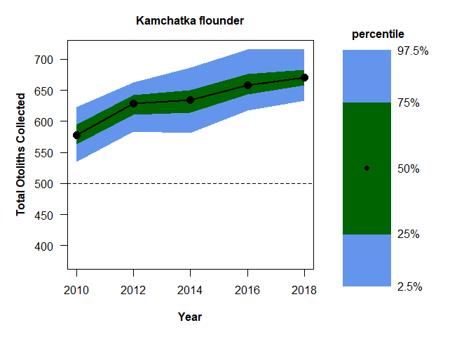<!-- -->

## northern rockfish

[top](#top)

|      **Management Area**       | **Quantity** |
| :----------------------------: | :----------: |
|   Southern Bering Sea (SBS)    |      5       |
| Eastern Aleutian Islands (EAI) |      5       |
| Central Aleutian Islands (CAI) |      5       |
| Western Aleutian Islands (WAI) |      5       |

  - If \< 5 are collected, do not collect.

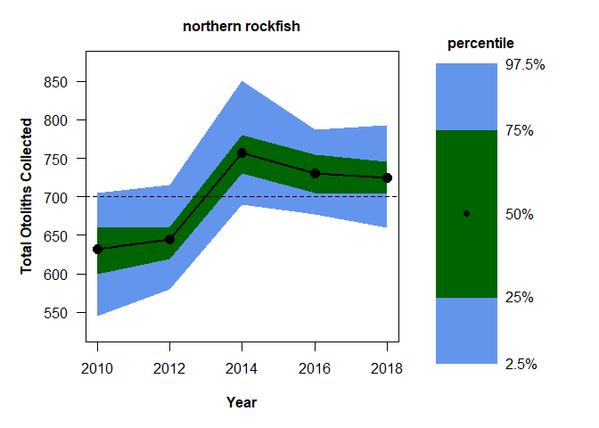<!-- -->

## northern rock sole

[top](#top)

|      **Management Area**       | **Quantity** |
| :----------------------------: | :----------: |
|   Southern Bering Sea (SBS)    |      2       |
| Eastern Aleutian Islands (EAI) |      2       |
| Central Aleutian Islands (CAI) |      2       |
| Western Aleutian Islands (WAI) |      2       |

  - If \< 2 are collected, do not collect.

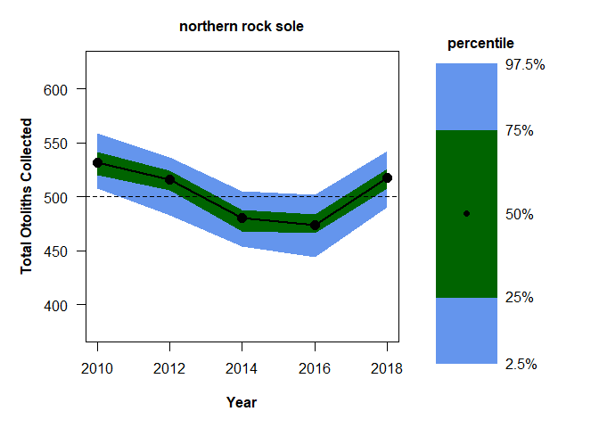<!-- -->

## Pacific cod

[top](#top)

|      **Management Area**       | **Quantity** |
| :----------------------------: | :----------: |
|   Southern Bering Sea (SBS)    |      3       |
| Eastern Aleutian Islands (EAI) |      3       |
| Central Aleutian Islands (CAI) |      3       |
| Western Aleutian Islands (WAI) |      3       |

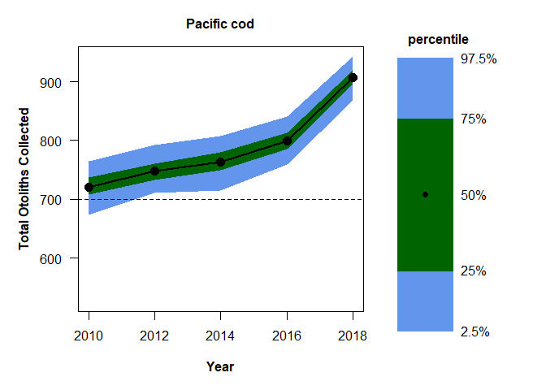<!-- -->

## Pacific ocean perch

[top](#top)

|      **Management Area**       | **Quantity** |
| :----------------------------: | :----------: |
|   Southern Bering Sea (SBS)    |      5       |
| Eastern Aleutian Islands (EAI) |      5       |
| Central Aleutian Islands (CAI) |      5       |
| Western Aleutian Islands (WAI) |      5       |

  - If \< 5 are collected, do not collect.

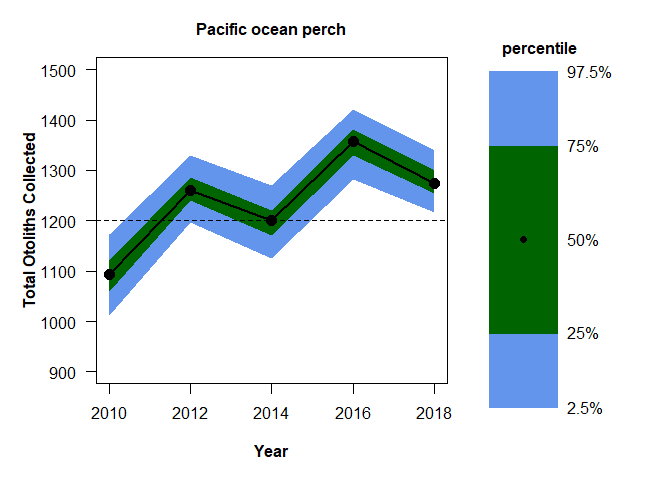<!-- -->

## rougheye rockfish

[top](#top)

|      **Management Area**       | **Quantity** |
| :----------------------------: | :----------: |
|   Southern Bering Sea (SBS)    |      10      |
| Eastern Aleutian Islands (EAI) |      10      |
| Central Aleutian Islands (CAI) |      10      |
| Western Aleutian Islands (WAI) |      10      |

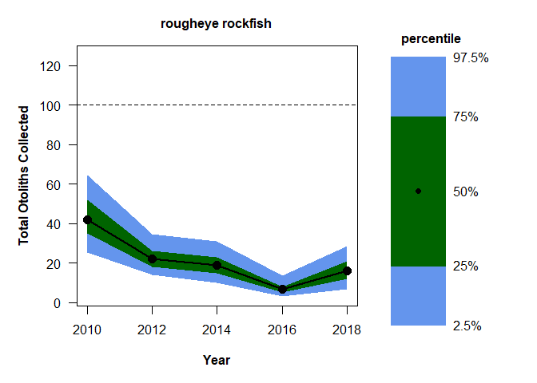<!-- -->

## shortraker rockfish

[top](#top)

|      **Management Area**       | **Quantity** |
| :----------------------------: | :----------: |
|   Southern Bering Sea (SBS)    |      12      |
| Eastern Aleutian Islands (EAI) |      12      |
| Central Aleutian Islands (CAI) |      12      |
| Western Aleutian Islands (WAI) |      12      |

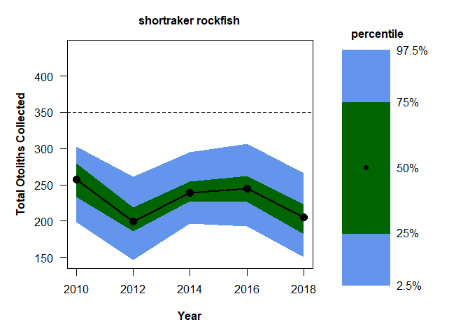<!-- -->

## shortspine thornyhead

[top](#top)

|      **Management Area**       | **Quantity** |
| :----------------------------: | :----------: |
|   Southern Bering Sea (SBS)    |      4       |
| Eastern Aleutian Islands (EAI) |      4       |
| Central Aleutian Islands (CAI) |      4       |
| Western Aleutian Islands (WAI) |      4       |

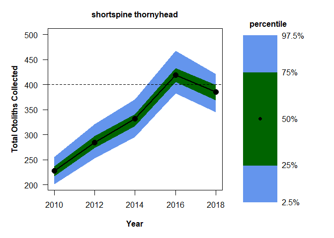<!-- -->

## southern rock sole

[top](#top)

|      **Management Area**       | **Quantity** |
| :----------------------------: | :----------: |
|   Southern Bering Sea (SBS)    |      10      |
| Eastern Aleutian Islands (EAI) |      10      |
| Central Aleutian Islands (CAI) |      0       |
| Western Aleutian Islands (WAI) |      0       |

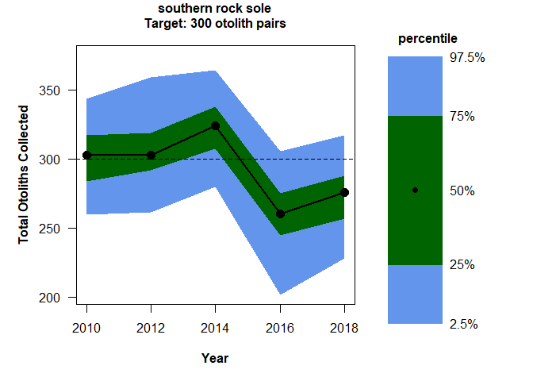<!-- -->
